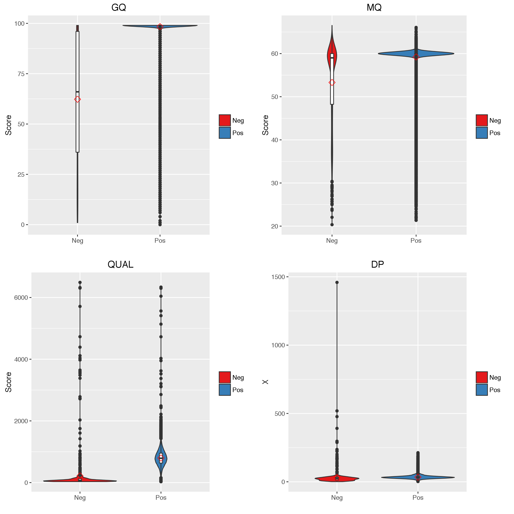
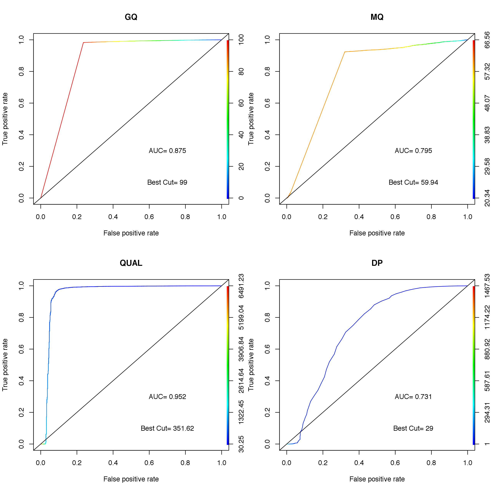

# Refine high-quality variant calling

### Background
Despite high-throughput sequencing approaches, variant detection is uncertain in few genomic regions and different sequencing settings - coverage, read length, sequencing depth dosage, and sequencing platform. 

Few models have been suggested to amerilorate this problem - i.e. the Variant Quality Score Recalibration (VQSR) by the GATK pipeline. However, such models may not be applied in general sequencing setting, or not fully represent sequencing settings in the different context - targeted sequencing, rare variant discovery, or low-cov sequencing data.

Hence, we utilize emprical truth variant set to examine filtering criteria for high-quality variant calling. 

### Input data
You will use validated variants as a positive set, and non-validated variants as a negative set. "Validated variants" can be the ones obtained from experimental data, or the ones overlapped among different pipeline/ reference sets. 

One example is Zook et al. (2014), who evaluates the criteria of high-quality variant calling. In this study, the authors use the set of concordant variant calls from multiple pipelines and sequencing platforms. Then, using [receiver operating characteristic (ROC) curves] (https://en.wikipedia.org/wiki/Receiver_operating_characteristic), they showed how false-positive and true-positive rates change while varying the cutoff for different quality metrics, such as read depth, variant quality score.  

### ROC curves
Here we use a simulated dataset to get quality metrics of ~50k variant calls. We set some are validated variants, defined as a positive set for ROC analysis and non-validated ones as a negative set. 

When we explore the distribution of each metric (**Figure 1**), some metrics, like GQ and QUAL, have clear distinction between the positive and negative set, so that we can easily infer which threshold will discriminate true-positives (TPs) and true-neagtives (TNs). However, metrics like MQ or DP do not have obvious cutoff for TPs and TNs we may want to use threshold for TPs at the cost of sensitivity.  

**Figure 1. Distribution of quality metrics between the positive and negative set of variant calls***

For ROC curve, we use the ROCR package in R, which measures performance and visualize such measurements over a range of cutoffs (**Figure 2**). The script is attached in the repo. 

**Figure 2. ROC curves**

### Reference 
Zook et al., Nature Biotechnology (2014). Integrating human sequence data sets provides a resource of benchmark SNP and indel genotype calls ([Link] (http://www.nature.com/nbt/journal/v32/n3/full/nbt.2835.html))